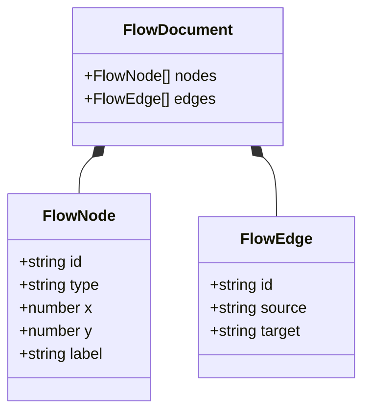

# 类图 / 模块结构（逻辑）

初版以 Vue 组合式函数与模块为主，无强 OO 类层次。示意：

```mermaid
classDiagram
  class FlowNode {
    +string id
    +string type
    +number x
    +number y
    +string label
  }
  class FlowEdge {
    +string id
    +string source
    +string target
  }
  class FlowDocument {
    +FlowNode[] nodes
    +FlowEdge[] edges
  }
  FlowDocument *-- FlowNode
  FlowDocument *-- FlowEdge
```
