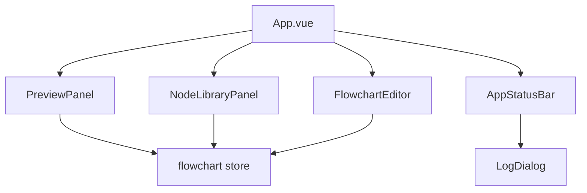

# 组件图（Mermaid）

```mermaid
flowchart TB
  App[App.vue]
  Preview[PreviewPanel]
  Library[NodeLibraryPanel]
  Editor[FlowchartEditor]
  Status[AppStatusBar]
  Log[LogDialog]
  Store[flowchart store]

  App --> Preview
  App --> Library
  App --> Editor
  App --> Status
  Status --> Log
  Preview --> Store
  Library --> Store
  Editor --> Store
```
